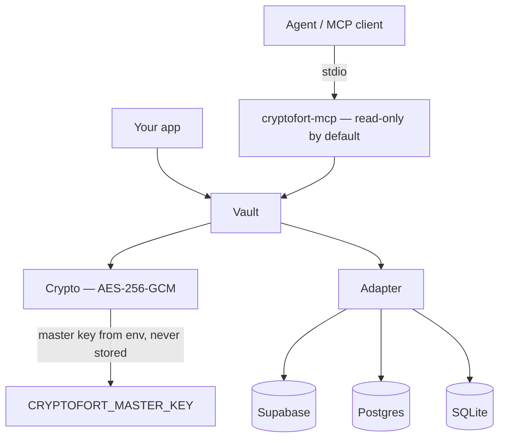

<p align="center">
  
</p>

<h1 align="center">CryptoFort</h1>

<p align="center">
  <b>An encrypted-at-rest credential vault with an MCP server for agents.</b>
</p>
<p align="center">
  AES-256-GCM secrets, a pluggable database backend, and a metadata-only-by-default<br />
  MCP server — so agents can find the credential they need without ever holding its value.
</p>

<p align="center">
  <a href="https://github.com/bradley-t-t/cryptofort/pkgs/npm/cryptofort"></a>
  
  =20" />
  
  
</p>

<br />

## Why CryptoFort

Secrets sprawl across `.env` files, shell history, and plaintext columns — and agents have no safe, structured way to ask for them. CryptoFort seals every secret with authenticated encryption, keeps the key out of the database entirely, and hands agents an MCP interface that returns metadata and nothing else. A conversational agent keeps whatever it is told, so the value itself is reached by a process that runs one operation with it, not by the agent that decided to run it.

<table width="100%">
  <tr>
    <td width="33%" valign="top">
      <h3 align="center">Encrypted at rest</h3>
      <p align="center">Every secret is sealed with AES-256-GCM. The master key lives only in the environment, so a database dump is inert on its own.</p>
    </td>
    <td width="33%" valign="top">
      <h3 align="center">Agent-native</h3>
      <p align="center">A built-in MCP server exposes <code>search</code> and <code>list</code> by default. Reading a secret, writing, and deleting are three separate opt-ins.</p>
    </td>
    <td width="33%" valign="top">
      <h3 align="center">Backend-agnostic</h3>
      <p align="center">The same vault runs on Supabase, SQLite, or any Postgres. Switch backends with a single environment variable.</p>
    </td>
  </tr>
</table>

<br />

## Stack

| Layer           | Technology                                                                    |
| :-------------- | :---------------------------------------------------------------------------- |
| Language        | TypeScript 5, ESM-first with a CJS build                                      |
| Encryption      | Web Crypto (`crypto.subtle`) — AES-256-GCM, 32-byte key from the environment  |
| Validation      | Zod 4 (MCP tool schemas)                                                      |
| Agent interface | `@modelcontextprotocol/sdk` over stdio, metadata-only by default              |
| Backends        | `@supabase/supabase-js`, `postgres`, or `better-sqlite3` — all optional peers |
| Build           | tsup (ESM + CJS + `.d.ts`)                                                    |
| Tests           | Vitest                                                                        |
| Runtime         | Node 20 or newer                                                              |

## Getting started

### Install

CryptoFort is published to GitHub Packages, which serves owner-scoped names and asks for authentication even on a public package. Point the `@bradley-t-t` scope at it and authenticate with a token carrying `read:packages`:

```ini
@bradley-t-t:registry=https://npm.pkg.github.com
//npm.pkg.github.com/:_authToken=${GITHUB_TOKEN}
```

```bash
npm install @bradley-t-t/cryptofort
# plus the driver for your backend:
npm install @supabase/supabase-js   # or: better-sqlite3 | postgres
# and, to run the MCP server:
npm install @modelcontextprotocol/sdk
```

Every driver — and the MCP SDK — is an **optional peer dependency**, so nothing is pulled in that you do not use. Requires Node 20 or newer.

## Library usage

```ts
import { Vault, Crypto, SqliteAdapter } from '@bradley-t-t/cryptofort';

const adapter = new SqliteAdapter('vault.db');
await adapter.init();

const vault = new Vault({
  adapter,
  crypto: new Crypto({ key: process.env.CRYPTOFORT_MASTER_KEY! }),
});

await vault.put({
  name: 'stripe-secret-key',
  secret: 'sk_live_…',
  provider: 'stripe',
  tags: ['payments'],
});
await vault.search('stripe'); // metadata only — never the secret
await vault.get('stripe-secret-key'); // the decrypted secret
```

Credentials can be given an expiry, after which they are deleted automatically:

```ts
await vault.put({
  name: 'ci-deploy-token',
  secret: 'ghp_…',
  expiresAt: '2026-09-01T00:00:00Z', // ISO 8601; pass null later to clear it
});

await vault.purgeExpired(); // delete every entry whose time has come up
```

Once `expiresAt` passes, the credential is dead everywhere at once: `get` deletes it and returns `null`, and `search`/`list` no longer show it — even before a purge sweep has physically removed the row. `purgeExpired()` does the physical cleanup; call it on whatever schedule suits your app (the MCP server runs it for you, at startup and hourly).

Generate a master key (base64, 32 bytes):

```bash
node -e "console.log(require('crypto').randomBytes(32).toString('base64'))"
```

…or from the library with `import { generateKey } from '@bradley-t-t/cryptofort'`.

## MCP server

The MCP server needs `@modelcontextprotocol/sdk` installed alongside CryptoFort. Point any MCP client at the `cryptofort-mcp` binary:

```json
{
  "mcpServers": {
    "cryptofort": {
      "command": "cryptofort-mcp",
      "env": {
        "CRYPTOFORT_ADAPTER": "supabase",
        "SUPABASE_URL": "https://<ref>.supabase.co",
        "SUPABASE_SERVICE_ROLE_KEY": "<service-role-key>",
        "CRYPTOFORT_MASTER_KEY": "<base64-32-bytes>"
      }
    }
  }
}
```

The server serves **metadata only** by default: it can say what the vault holds, and nothing that would tell you a secret. Two flags widen that, and they are separate because they answer different questions.

- `"args": ["--allow-secret-read"]` exposes `credential_get`, which returns a decrypted secret to whoever called it. Give it to a process that will use the value and exit — not to an agent whose conversation is written to disk, because a secret handed to one stays in that transcript for as long as the transcript does.
- `"args": ["--allow-write"]` exposes `credential_put` and `credential_purge_expired`. A put can be put again, and a purge only removes what an expiry had already killed.
- `"args": ["--allow-delete"]` exposes `credential_delete`. It is separate because it is the one call the vault cannot answer for afterwards: the secret is gone and no copy is kept.

### Tools

| Tool                       | Access      | Description                                                                                     |
| :------------------------- | :---------- | :---------------------------------------------------------------------------------------------- |
| `credential_search`        | default     | Search by name, description, provider, or tag. Returns metadata only.                           |
| `credential_list`          | default     | List credential metadata in a namespace, optionally filtered by tag.                            |
| `credential_get`           | secret read | Decrypt and return a single secret by exact name. Requires `--allow-secret-read`.               |
| `credential_put`           | write       | Create or update a credential, optionally with an `expiresAt` expiry. Requires `--allow-write`. |
| `credential_purge_expired` | write       | Delete every credential whose expiry has passed. Requires `--allow-write`.                      |
| `credential_delete`        | delete      | Permanently delete a credential by exact name. Requires `--allow-delete`.                       |

Expired credentials are also purged automatically: the server sweeps them at startup and every hour after that, and an expired entry is unreadable the moment its time passes. Expiries belong to whoever set them, so the sweep runs whatever the server was started with.

### Environment

| Variable                                     | Required | Purpose                                                                                |
| :------------------------------------------- | :------- | :------------------------------------------------------------------------------------- |
| `CRYPTOFORT_MASTER_KEY`                      | always   | Base64, 32-byte AES-256 key. Never written to the database.                            |
| `CRYPTOFORT_ADAPTER`                         | —        | `supabase` (default), `sqlite`, or `postgres`.                                         |
| `CRYPTOFORT_KEY_ID`                          | —        | Key identifier for rotation. Defaults to `default`.                                    |
| `SUPABASE_URL` / `SUPABASE_SERVICE_ROLE_KEY` | Supabase | Connection for the Supabase adapter.                                                   |
| `CRYPTOFORT_SUPABASE_DB_URL`                 | —        | Direct Postgres URL, used only to auto-create the schema. Needs the `postgres` driver. |
| `CRYPTOFORT_POSTGRES_URL`                    | Postgres | Connection string for the Postgres adapter.                                            |
| `CRYPTOFORT_SQLITE_PATH`                     | —        | SQLite file path. Defaults to `cryptofort.db`.                                         |

## Backends

| Backend      | Driver                  | Best for                                                  |
| :----------- | :---------------------- | :-------------------------------------------------------- |
| **Supabase** | `@supabase/supabase-js` | Hosted, shared across agents, service-role access.        |
| **Postgres** | `postgres`              | Dropping the vault into existing Postgres infrastructure. |
| **SQLite**   | `better-sqlite3`        | Local, single-process, zero-infrastructure use.           |

## Architecture



## How it works

- Only the secret is ciphertext. `name`, `description`, `provider`, and `tags` stay plaintext, so search and listing work without ever decrypting.
- Each secret is sealed with **AES-256-GCM** — authenticated encryption, so any tampering is caught on read.
- The **master key never touches the database.** It lives only in `CRYPTOFORT_MASTER_KEY`; a stolen dump reveals nothing without it.
- The MCP server registers a tool only when the permission covering it was given, so a caller cannot reach `credential_get`, `credential_put`, or `credential_delete` at all rather than being trusted to respect a refusal. A default server can describe the vault and change nothing in it.
- Credentials with an `expiresAt` die on schedule: reads treat an expired entry as gone immediately, and purge sweeps (hourly in the MCP server, or `vault.purgeExpired()` in your own code) delete the rows themselves.

## Schema

CryptoFort creates its schema automatically on first connect — one table, one ciphertext column, the rest plaintext metadata for search. There is no migration to run by hand.

- **SQLite** and **Postgres**: `adapter.init()` issues `create table if not exists` (plus indexes), so pointing CryptoFort at an empty database is enough.
- **Supabase**: the client speaks PostgREST, which cannot run DDL. `init()` probes for the table and, when it is missing, creates it through a direct Postgres connection given in `CRYPTOFORT_SUPABASE_DB_URL`. If the table already exists the probe is a no-op; if it is missing and no DB URL is set, `init()` fails with a clear message instead of silently.

The canonical column definitions live in [`src/adapters/schema.ts`](src/adapters/schema.ts).

## Project structure

```
cryptofort/
├── assets/cryptofort-hero.png
├── src/
│   ├── index.ts               Public surface — Vault, Crypto, the three adapters, types
│   ├── vault.ts               put / get / search / list / remove / purgeExpired over an adapter
│   ├── crypto.ts              AES-256-GCM seal/open, generateKey
│   ├── types.ts               Credential and search types, DEFAULT_NAMESPACE
│   ├── adapters/
│   │   ├── types.ts           The CredentialStore contract
│   │   ├── schema.ts          Canonical column definitions
│   │   ├── supabase.ts        PostgREST, with optional direct-Postgres provisioning
│   │   ├── postgres.ts        `postgres` driver
│   │   └── sqlite.ts          better-sqlite3
│   └── mcp/
│       ├── bin.ts             The `cryptofort-mcp` executable and its permission flags
│       ├── server.ts          Tool definitions, exported as `cryptofort/mcp`
│       ├── config.ts          Crypto and adapter construction from the environment
│       └── env.ts             Reading and refusing environment values
├── test/                      crypto, vault, mcp, and one suite per adapter
└── tsup.config.ts
```

## Development

```bash
npm install
npm run build      # bundle with tsup
npm test           # run the vitest suite
```

| Script                 | Does                                                 |
| :--------------------- | :--------------------------------------------------- |
| `npm run build`        | Bundle ESM, CJS, and types with tsup.                |
| `npm test`             | Run the Vitest suite.                                |
| `npm run typecheck`    | `tsc --noEmit`.                                      |
| `npm run lint`         | Lint with ESLint.                                    |
| `npm run format`       | Rewrite files to Prettier's formatting.              |
| `npm run format:check` | Check formatting without rewriting, the way CI does. |

Backend drivers are optional peer dependencies — install only the one you use.

## License

Released under the MIT License.

<br />

<p align="center">
  <sub>Secrets sealed at rest — used by agents, held by none of them.</sub>
</p>
